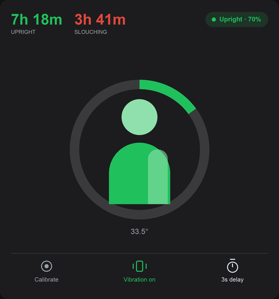

# Upright GO 2 for Home Assistant

A custom integration that talks to the [Upright GO 2](https://www.uprightpose.com/)
posture trainer over Bluetooth LE — including through an **ESPHome Bluetooth
proxy**, so the device does not need to be near the Home Assistant host.

No cloud, no account, no phone app in the loop. Home Assistant connects
directly to the device's GATT services.



## What you get

| Entity | Type | Notes |
|---|---|---|
| Battery | sensor | percent |
| Charging | binary sensor | on whenever it sits on the charger, full included |
| Slouching | binary sensor | |
| Posture angle | sensor | degrees, one decimal |
| Movement | sensor | still / moving, from the live interval stream |
| Mode | select | posture / MSK programme |
| Vibration | switch | slouch buzz on/off |
| Vibration pattern | select | 9 patterns |
| Vibration strength | select | gentle / medium / strong |
| Posture sensitivity | number | 1–6 |
| Vibration delay | number | seconds before the buzz |
| Slouching time | sensor | cumulative, drives the daily statistics |
| Upright time | sensor | cumulative |
| History last synced | sensor | diagnostic |
| Calibrate | button | sets the current pose as upright |
| Sync history | button | pull stored history now |
| Clear history | button | erases on-device history, disabled by default |
| Clear calibration | button | disabled by default |
| Deep sleep | button | disabled by default |

## Posture totals and history

Two cumulative counters, **Slouching time** and **Upright time**, in seconds.
They only ever go up, so Home Assistant's recorder derives per-day, per-week
and per-month figures from them automatically — add either to a **Statistics**
card, pick *Change* and a daily period, and you get exactly how long you spent
slouched on each day.

They are fed from two places:

- **Live**, while the connection is up: the time each posture lasts is added as
  it elapses.
- **Topped up from the device**, for the stretches nothing was connected. The
  GO 2 records to flash while offline, so a period when Home Assistant was down
  or out of range is recovered on the next sync.

A watermark of what has already been counted keeps the two from
double-counting, and an outage is never banked as posture time. The totals are
persisted, so a restart continues rather than resetting to zero.

**Nothing is counted while the unit is on its charger**, full or still filling. Off your back it still
reports a posture, but that is the pose of a device lying on a desk — left
running, a night on the charger banks as eight hours of perfect posture. So the
clock stops for as long as it is plugged in (charging *or* full), the automatic
history sync is skipped, and the watermark is walked through the charge so the
device's own recording cannot re-credit it afterwards. The interval that ends
with it on the charger is discarded rather than banked, because that is the
stretch during which it came off your back.

A genuine offline backlog is left alone: if the watermark is more than an hour
behind, that is a real recording waiting to sync, not a charge, and it is still
picked up once the unit comes off the charger. The manual *Sync history* button
always works.

History syncs hourly by default (configurable, 10 min – 24 h) and can be
triggered with the *Sync history* button. Nothing is deleted from the device
unless you press *Clear history*, which is disabled by default.

Resolution of the topped-up part is the device's own recording interval — 10 s
out of the box.

## Dashboard card

The integration ships a custom card and registers it itself — no dashboard
resource to add by hand. It shows a silhouette that leans with the measured
angle in real time, a ring that turns red when you slouch, the running totals,
and a calibrate / vibration / delay row. On the charger it goes amber and reads
*Charging*, with the figure standing straight — see below for why.

```yaml
type: custom:upright-go2-card
angle: sensor.upright_go_2_posture_angle
slouching: binary_sensor.upright_go_2_slouching
charging: binary_sensor.upright_go_2_charging
battery: sensor.upright_go_2_battery
upright_time: sensor.upright_go_2_upright_time
slouching_time: sensor.upright_go_2_slouching_time
vibration: switch.upright_go_2_vibration
delay: number.upright_go_2_vibration_delay
calibrate: button.upright_go_2_calibrate
# Angles that count as fully upright and fully slouched, which depend on how
# the unit sits on your back. Tune these if the figure leans too much or
# too little.
upright_angle: 35
slouch_angle: 75
```

## Modes

**Mode** switches the device between its two programmes, the same pair the app
offers: **Posture** and **MSK**. It is byte 3 of the device's general settings —
the app calls these switchToPostureSettings and switchToMSKSettings and tells
them apart by that byte. Only that byte is written here, so your delay,
pattern and sensitivity survive the switch.

**Movement** is a separate thing: the device streams live interval records on
its ONLINE_DATA characteristic, and bits 5-4 of each carry the movement state
the app renders as sitting versus moving. It is reported as *still* or *moving*.

Training versus tracking is not a device mode — in the app it is just whether
the buzz is on, which is the **Vibration** switch.

## Noise, and why it matters

The device emits the angle about fifteen times a second and flips its posture
bit several times a second whenever you hover near the threshold. Taken at face
value that produces two problems, and both are handled in the integration
rather than left for you to paper over:

**Posture debounce** (default 3 s). A posture change has to hold before it is
believed. Without it the slouching binary sensor toggled on/off within the same
second, which makes it useless as an automation trigger — you would have needed
`for: 00:00:30` on every trigger or a template sensor with your own debounce.
The debounced value also drives the time accounting, so the totals stop
counting chatter.

**Angle change to report** (default 3°). The angle is published only once it has
actually moved that far, with a five-minute heartbeat so its history never goes
silent. Rate-limiting alone was not enough: at two updates a second it still
wrote roughly 150k rows a day from this one entity, enough to bloat a SQLite
recorder within a week and slow down history queries for everything else.
Measured on a real device, the two gates together took this from about 150k
rows a day to roughly 5,700 — a rate of 0.07 writes a second while seated.

Both are under the integration's **Configure** menu. Raise the angle threshold
to 5° if the database still grows faster than you like; lower it for smoother
card animation. If you do not want the raw angle recorded at all, the totals
already carry everything needed for analysis:

```yaml
recorder:
  exclude:
    entities:
      - sensor.upright_go_2_posture_angle
```

## Staying connected

A Bluetooth link can die without either end noticing — the proxy still holds the
connection open, the device is already gone. Every GATT operation therefore has
its own deadline, the whole poll has one behind it, and a link that goes quiet
for a minute while still claiming to be up is torn down on purpose. Any of those
starts a reconnect immediately rather than waiting for the next poll, with a
5 s to 2 min backoff.

This matters more than it sounds: the coordinator only schedules its next poll
once the current one returns, so a single read with no deadline does not cost
one cycle — it stops every future cycle, the watchdog included, and the
integration goes silent with nothing in the log.

A connection is also checked for the characteristics that carry the posture bit
and the angle. Service discovery can come back without them, and because the
service table is cached, every later reconnect is handed the same broken one:
the link comes up, nothing ever notifies, and no error is logged. When that
happens the cache is dropped and the services are rediscovered.

## Protocol

The BLE protocol was reverse-engineered from the official Android app and is
documented in full in [`docs/PROTOCOL.md`](docs/PROTOCOL.md): service and
characteristic UUIDs, byte offsets, enums and command values.

## Disclaimer

Not affiliated with or endorsed by Upright Technologies or DarioHealth.
"Upright GO" is their trademark. Use at your own risk — writing settings and
`Deep sleep` change device state.

## Licence

MIT — see [LICENSE](LICENSE).
